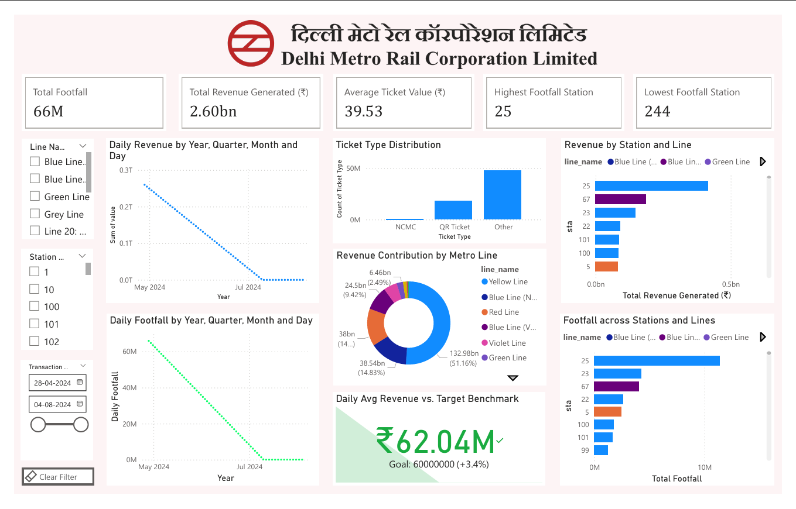

# DMRC ATS Power BI Dashboard

Interactive analytics dashboard built during my internship 
as **IT & Data Analyst at Delhi Metro Railway Corporation 
(DMRC)**, June–July 2025.

> ⚠️ All operational data is confidential per DMRC policy.
> This repo contains schema, methodology, anonymised sample 
> data, and blurred dashboard screenshots only.

---

## 📊 Dashboard Preview

---

## 📏 Project Scale

| Metric | Value |
|---|---|
| Total footfall analysed | 66M+ passengers |
| Total revenue tracked | ₹2.60 billion |
| Average ticket value | ₹39.53 |
| Daily avg revenue | ₹62.04M (3.4% above target) |
| Raw dataset size | ~256 GB |
| Abstraction applied | ~20% sample used |
| Period covered | May 2024 – Aug 2024 |
| Metro lines covered | Yellow, Blue (N/V), Red, Violet, Green |

---

## 🎯 What This Dashboard Does

- Tracks **daily revenue trends** with 30-day moving 
  average benchmark (₹60M target)
- Breaks down **ticket type distribution** — NCMC, 
  QR Ticket, and legacy ticket holders
- Shows **revenue contribution by metro line** — Yellow 
  Line leads at 51.16% of total revenue
- Maps **station-wise footfall and revenue** across 
  200+ stations
- Provides **interactive filters** by line, station, 
  and date range for operational drill-down

---

## 🛠️ Tech Stack

| Tool | Purpose |
|---|---|
| Power BI | Dashboard and interactive visualisation |
| PostgreSQL | Primary database and schema design |
| Python | Data abstraction and pipeline automation |
| SQL Window Functions | Rolling averages and trend analysis |
| Excel VBA | Supplementary operational reporting |

---

## 📈 Analytical Methods

- **PostgreSQL window functions** for 30-day rolling 
  revenue averages — basis for the ₹60M daily target 
  benchmark
- **Statistical trend detection** in Python to identify 
  revenue and footfall patterns across the May–Aug 2024 
  period
- **Passenger segmentation** by ticket type (NCMC vs QR 
  vs Other) using PostgreSQL aggregation queries
- **Station-to-station revenue matrix** using multi-table 
  JOIN queries across transactions, stations and lines

---

## 🗄️ Database Schema

See [`schema/database_schema.sql`](schema/database_schema.sql)

**Key design decisions:**
- `BIGSERIAL` primary key for high-volume insert 
  performance
- Indexes on `insertion_datetime`, `station_id`, 
  `line_id` and `passenger_type` for fast aggregation
- Separate lookup tables for stations and lines — 
  normalised structure reduces redundancy across 
  billions of rows
- `daily_revenue_trend` view pre-computes rolling 
  averages for Power BI performance

---

## 📁 Repository Structure