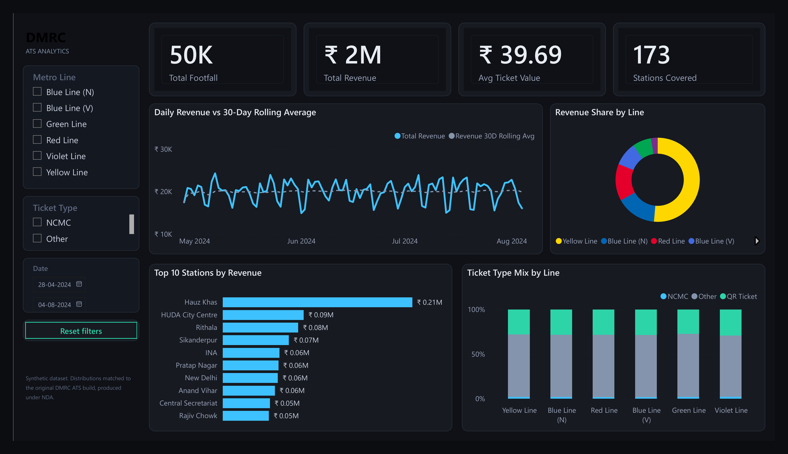
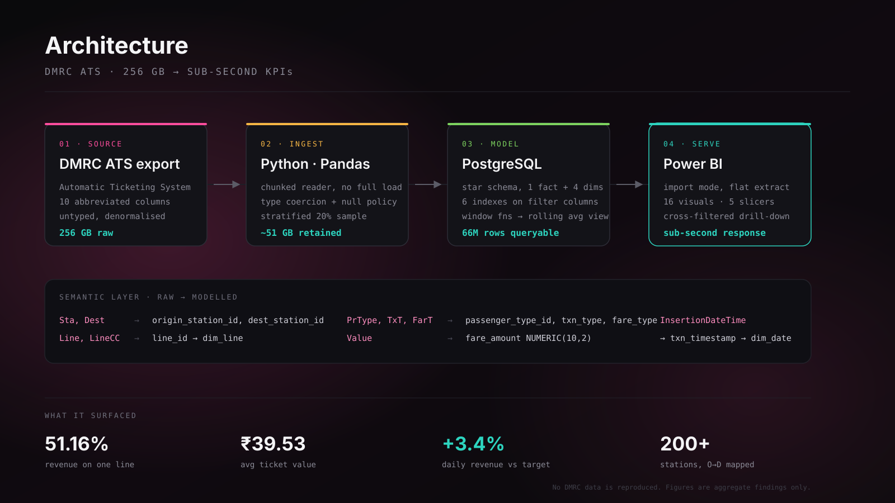

# DMRC ATS Analytics

**Turning 256 GB of Delhi Metro ticketing data into decisions leadership can act on the same morning.**

Built during my internship as IT & Data Analyst at **Delhi Metro Rail Corporation**, June–July 2025.

<p>
  
  
  
  
  
</p>

---

## The constraint, up front

This dashboard was built against **live DMRC Automatic Ticketing System data under an NDA**. That data cannot leave DMRC and is not present anywhere in this repository — no extract, no sample of it, no station master.

So this repo ships everything *except* the data:

- the **schema** the raw export was modelled into
- the **SQL** behind every visual on the report
- a **synthetic data generator** that reproduces the dataset's statistical shape
- **screenshots** of the built dashboard with operational figures blurred

Clone it, run the generator, load the schema, and the whole thing runs end to end on your machine. Working inside a data-governance constraint was part of the job, and this repo is built to be honest about it rather than around it.

---

## Dashboard



*Report page as built in Power BI Desktop. Station-level and revenue figures are blurred per DMRC policy; the aggregate findings below are cleared for publication.*

---

## Scale and findings

| | |
|---|---|
| Raw dataset | ~256 GB |
| Transactions analysed | 66M+ |
| Sampling | ~20%, stratified |
| Period | 28 Apr – 4 Aug 2024 |
| Stations | 200+ across 6 line segments |
| Total revenue tracked | ₹2.60 bn |

**What the analysis surfaced:**

- **Revenue is concentrated.** The Yellow Line alone carries **51.16%** of network revenue. A single-line disruption is therefore a network-level revenue event — a framing that was not visible before the line-share breakdown existed.
- **Daily average revenue ran ₹62.04M against a ₹60M benchmark (+3.4%)** — where the benchmark was *derived* from the 30-day rolling average rather than assumed.
- **Average ticket value settled at ₹39.53**, sitting between the ₹30 and ₹40 fare slabs — directly useful for modelling the revenue impact of any slab revision.
- **Digital adoption is uneven by line.** Normalising passenger type *within* each line (rather than comparing raw counts) showed NCMC and QR penetration varying widely across the network — invisible in absolute numbers, because line volumes differ by an order of magnitude.

---

## Architecture



```
DMRC ATS  ──►  Python + Pandas   ──►  PostgreSQL      ──►  Power BI
256 GB         chunked ingest,        star schema,         import model,
raw export     stratified 20%         indexed, rolling     16 visuals,
               sample, coercion       average view         5 slicers
```

The heavy lifting happens in PostgreSQL, not in DAX. Power BI imports pre-aggregated views, which is why a 66M-row dataset responds to slicer interaction in under a second.

---

## The semantic layer

The ATS export arrives with abbreviated, untyped, denormalised columns. Step one was making it mean something.

| Raw ATS column | Modelled as | Feeds |
|---|---|---|
| `Sta` | `origin_station_id` → `dim_station` | Revenue by Station, station slicer |
| `Dest` | `dest_station_id` → `dim_station` | Station-to-station matrix |
| `Line` | `line_id` → `dim_line` | Line slicer, revenue share |
| `LineCC` | `line_colour_cc` | Line grouping and colour mapping |
| `PrType` | `passenger_type_id` → `dim_passenger_type` | Donut, 100% stacked column |
| `TxT` | `txn_type` | Entry/exit segmentation |
| `FarT` | `fare_type` | Concession analysis |
| `Value` | `fare_amount NUMERIC(10,2)` | Every revenue measure |
| `TrxDetail` | `txn_detail` | Tooltips |
| `InsertionDateTime` | `txn_timestamp` → `dim_date` | Trend line, date slicer |

Full DDL: [`schema/database_schema.sql`](schema/database_schema.sql) · Mapping logic: [`sql/01_load_raw_to_core.sql`](sql/01_load_raw_to_core.sql)

---

## Analytical methods

Every visual maps to a query in [`sql/02_analysis_queries.sql`](sql/02_analysis_queries.sql).

**30-day rolling revenue average.** A raw daily series on metro data is dominated by the weekday/weekend swing, which makes it useless for reading trend. A trailing 30-day mean flattens the weekly cycle — and it is what the ₹60M daily target was derived from, rather than picked.

```sql
AVG(SUM(fare_amount)) OVER (
    ORDER BY txn_date
    ROWS BETWEEN 29 PRECEDING AND CURRENT ROW
) AS revenue_30d_rolling_avg
```

**Line revenue share in a single pass.** `SUM(SUM(...)) OVER ()` computes each line's share without re-scanning the fact table — this is the query that surfaced the 51.16% concentration finding.

**Passenger mix normalised within line.** `PARTITION BY line_name` turns raw counts into comparable percentages, which is the only way digital adoption reads meaningfully across lines of very different volume.

**Origin→destination revenue matrix.** A self-join on `dim_station` resolves both ends of each journey. Capped to the top 500 pairs by revenue: the full matrix across 200+ stations is ~40,000 cells, which renders slowly and nobody reads.

---

## Decisions and tradeoffs

**Why a 20% sample, not the full 256 GB.** Full-volume refresh made iteration impossible — a single model change cost hours. A stratified 20% sample preserved the hourly profile and line mix (verified in Q8) while cutting the build loop to minutes. Final figures were validated against full-volume aggregates.

**Why the rolling average lives in a SQL view, not DAX.** PostgreSQL computes it once per refresh; in DAX it would recompute on every slicer click. This single decision accounts for most of the sub-second response time.

**Why Power BI imports a flat extract despite a star schema upstream.** Import mode over a denormalised extract outperformed DirectQuery against the star schema for this workload. The star schema still earns its place — it is where the joins, indexes and views live. The flat table is a serving artifact, not the model.

**Why failed rows are dropped, not defaulted.** A null fare silently coerced to `0` would understate revenue. A row count that does not tie exactly is a visible problem; quietly wrong revenue is not.

**Why `BIGSERIAL`.** At production volume, `INTEGER` would have wrapped.

---

## Run it yourself

```bash
# 1. synthetic data — no DMRC records, matched distributions
python data/generate_sample.py --rows 500000

# 2. schema
psql -d dmrc -f schema/database_schema.sql

# 3. load + model
psql -d dmrc -c "\copy raw.ats_transactions(\"Sta\",\"Dest\",\"Line\",\"LineCC\",\"PrType\",\"TxT\",\"FarT\",\"Value\",\"TrxDetail\",\"InsertionDateTime\") FROM 'data/sample_data.csv' CSV HEADER"
psql -d dmrc -f sql/01_load_raw_to_core.sql

# 4. explore
psql -d dmrc -f sql/02_analysis_queries.sql
```

The generator prints its own distribution check against the real targets:

```
  rows                50,000
  avg ticket value    Rs 39.58   (target 39.53)
  revenue share by line
    Yellow Line       51.59%   (target 51.16%)
    Blue Line (N)     15.37%   (target 14.83%)
    Red Line          14.16%   (target 14.63%)
    ...
```

---

## Repository structure

```
├── Readme.md
├── data/
│   ├── generate_sample.py       synthetic generator, stdlib only
│   └── sample_data.csv          50k generated rows, committed for convenience
├── schema/
│   └── database_schema.sql      raw landing + star schema + serving views
├── sql/
│   ├── 01_load_raw_to_core.sql  raw → modelled mapping
│   └── 02_analysis_queries.sql  the query behind every visual
├── docs/
│   └── pipeline.svg             architecture diagram
└── screenshots/
    ├── 01_dashboard_full.png
    ├── 02_interactivity.png
    ├── 03_model_view.png
    ├── 04_kpi_detail.png
    └── reference_spec.png       the brief we were given, for comparison
```

---

## Attribution

`screenshots/reference_spec.png` is the **reference prototype provided by our DMRC mentor** as the target specification for the build. It is included to show the brief we worked against. Every other screenshot is the dashboard my team and I built.

## Data statement

No DMRC operational data — raw, sampled, aggregated or anonymised — is contained in this repository. All values under `data/` are synthetically generated. The aggregate figures quoted above are published findings only, and contain no passenger, transaction or station-level detail.

---

**Saurabh Sharma** · IT & Data Analyst Intern, DMRC (Jun–Jul 2025)
